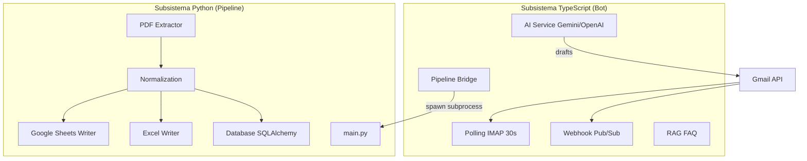
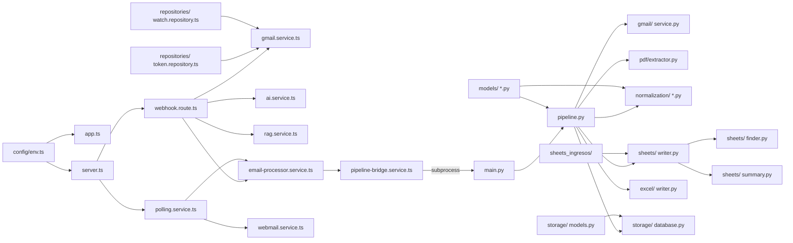
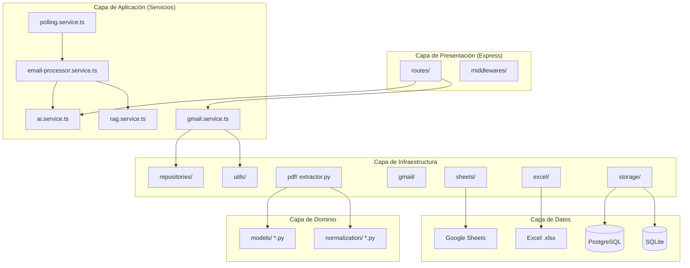
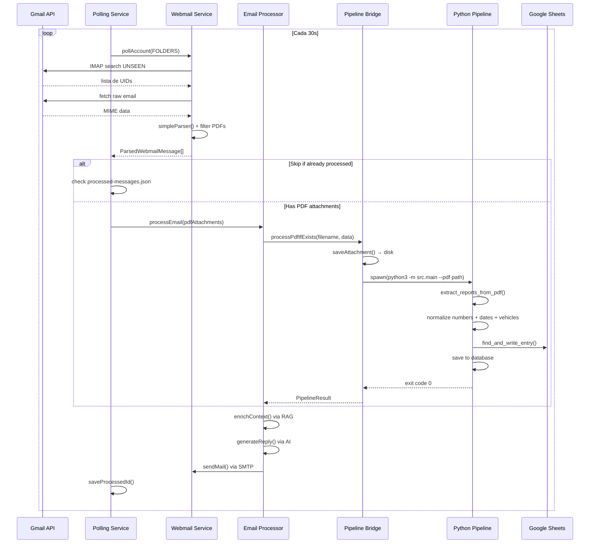
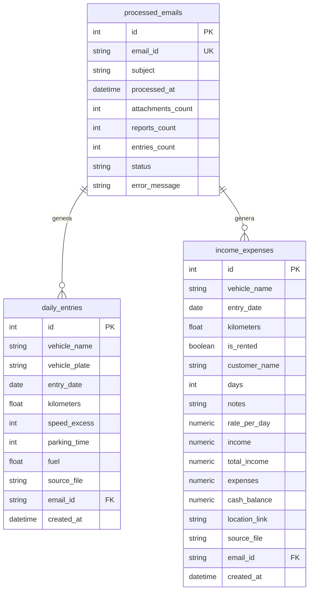
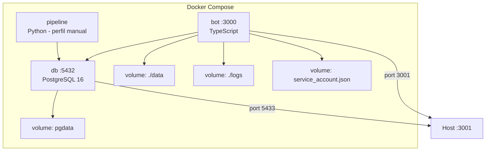
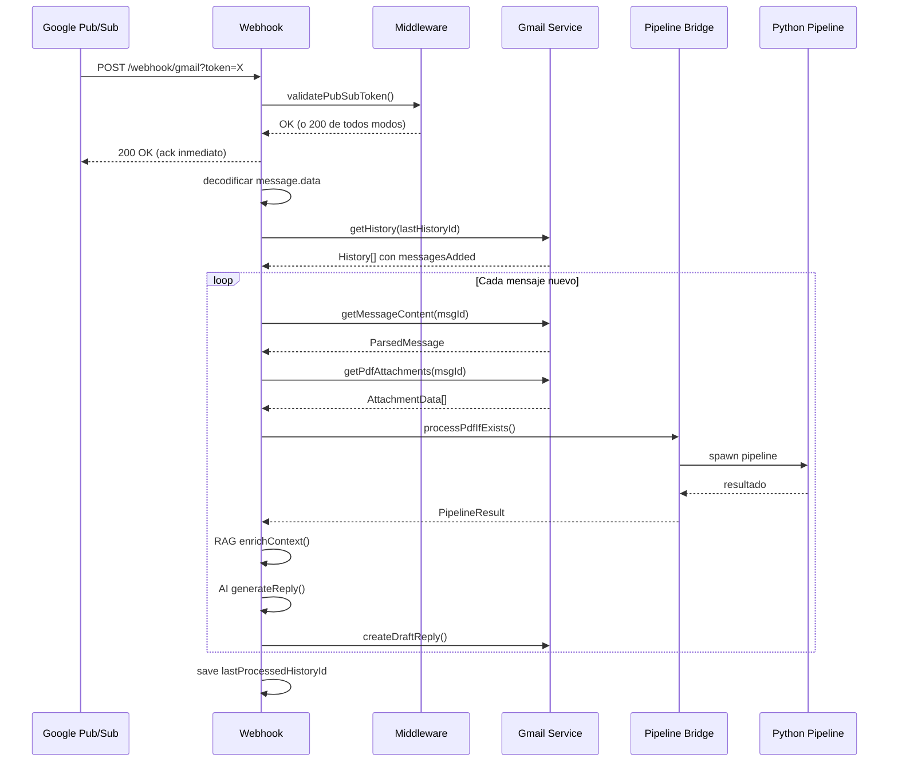
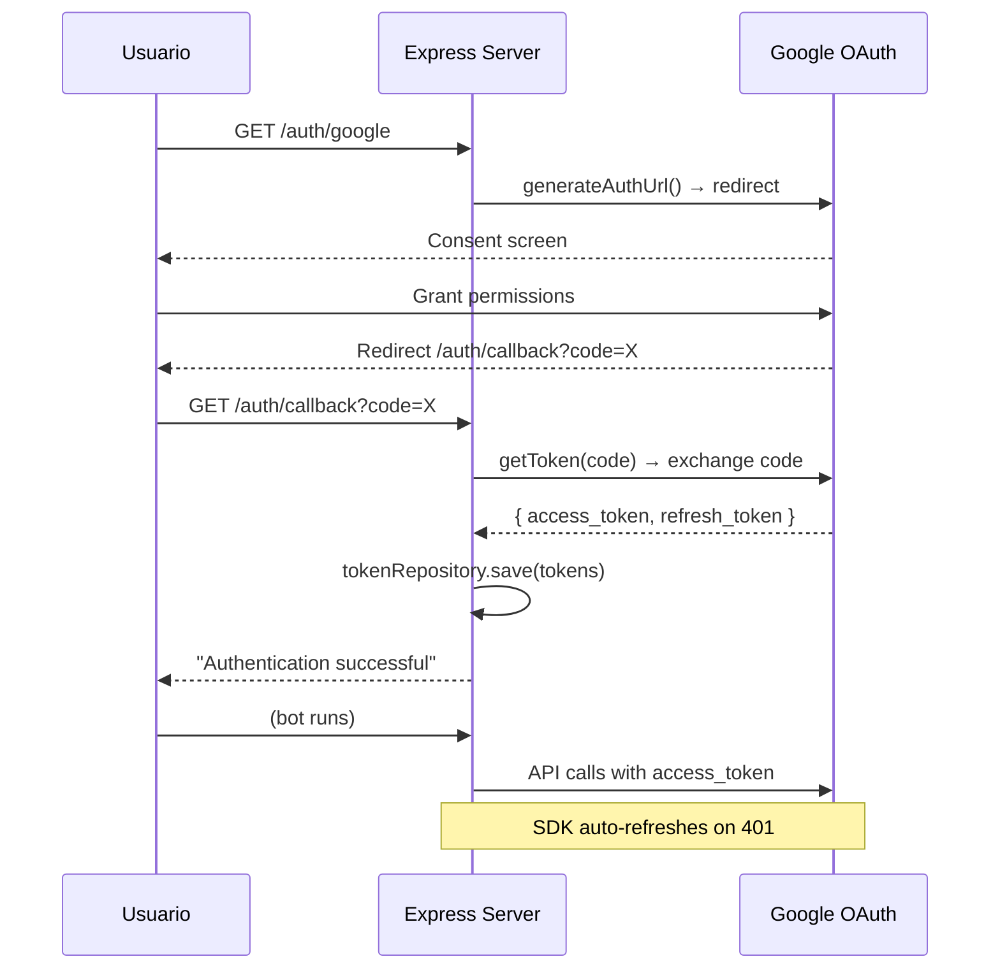
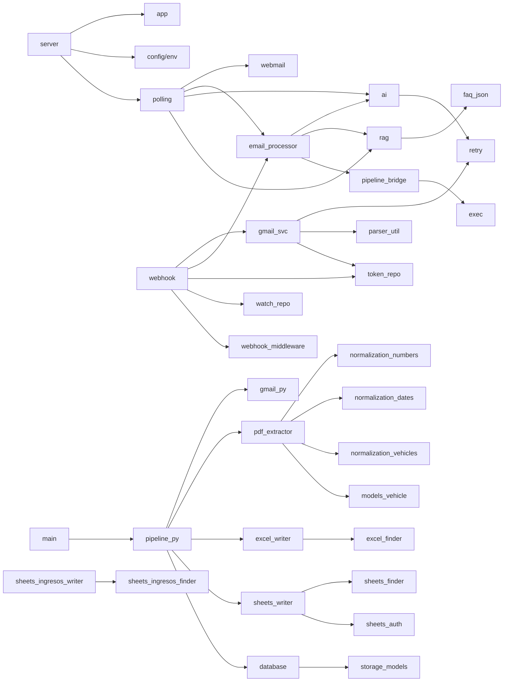

# DOCUMENTACIÓN TÉCNICA COMPLETA — AI GMAIL BOT

> Auditoría técnica generada el 2026-06-16 mediante análisis estático del repositorio.
> Versión del proyecto: 2.0.0

---

## 1. RESUMEN EJECUTIVO

### 1.1 Objetivo del proyecto

Sistema dual (TypeScript + Python) que automatiza la lectura de correos Gmail/webmail, descarga adjuntos PDF de rapports kilométricos (formato Quebec), extrae datos de kilometraje, y los escribe en Google Sheets (destino principal) o Excel local. Adicionalmente genera borradores de respuesta automáticos con IA (Gemini/GPT-4o).

**Usuario final:** Pequeñas/medianas empresas (flotillas de vehículos) que reciben reportes de kilometraje por correo y necesitan registrar los datos en hojas de cálculo de forma automatizada.

### 1.2 Dominio de negocio

- **Industria:** Gestión de flotas vehiculares / Transporte
- **Vocabulario clave:** `Rapport kilométrique`, `Appareil`, `kilometraje`, `exceso de velocidad`, `estacionamiento`, `combustible`, `placa`, `hoja de vida vehicular`

### 1.3 Casos de uso principales

| # | Caso de uso | Archivos |
|---|------------|----------|
| 1 | Leer correos Gmail vía polling IMAP (3 cuentas) | `src/services/polling.service.ts`, `src/services/webmail.service.ts` |
| 2 | Recibir notificaciones push via Pub/Sub webhook | `src/routes/webhook.route.ts`, `src/middlewares/webhook.middleware.ts` |
| 3 | Descargar PDFs adjuntos de correos | `src/services/pipeline-bridge.service.ts`, `src/services/gmail.service.ts` |
| 4 | Extraer datos de PDFs de kilometraje Quebec | `src/pdf/extractor.py` |
| 5 | Normalizar números, fechas y nombres de vehículos | `src/normalization/numbers.py`, `src/normalization/dates.py`, `src/normalization/vehicles.py` |
| 6 | Escribir datos en Google Sheets (kilometraje) | `src/sheets/writer.py`, `src/sheets/finder.py` |
| 7 | Escribir en hoja de ingresos/gastos | `src/sheets_ingresos/writer.py` |
| 8 | Escribir en Excel local (legacy) | `src/excel/writer.py`, `src/excel/finder.py` |
| 9 | Generar borradores de respuesta con IA | `src/services/ai.service.ts`, `src/rag/rag.service.ts` |
| 10 | Persistir tracking en PostgreSQL/SQLite | `src/storage/database.py`, `src/storage/models.py` |

### 1.4 Arquitectura general

**Tipo:** Híbrida — monolito con 2 subsistemas acoplados vía subprocess. Arquitectura de capas (Presentation → Application → Domain → Infrastructure) dentro de cada subsistema.

**Diagrama de alto nivel:**


---

## 2. STACK TECNOLÓGICO

| Categoría | Tecnología | Versión | Archivo de evidencia |
|-----------|-----------|---------|---------------------|
| Lenguaje (Bot) | TypeScript | 5.4.5 | `package.json:43` |
| Lenguaje (Pipeline) | Python | 3.12 | `Dockerfile:1` |
| Runtime | Node.js | 20 (Alpine) | `Dockerfile.bot:1,9` |
| Framework backend | Express | 4.18.3 | `package.json:26` |
| ORM | SQLAlchemy | 2.0.29 | `requirements.txt:12` |
| BD principal | PostgreSQL 16 | 16-alpine | `docker-compose.yml:19` |
| BD local/fallback | SQLite | (built-in) | `src/storage/database.py:39` |
| Google Sheets API | gspread | ≥6.0.0 | `requirements.txt:5` |
| Procesamiento PDF | pdfplumber | 0.10.3 | `requirements.txt:8` |
| Excel | openpyxl | 3.1.2 | `requirements.txt:7` |
| IA (Gemini) | @google/generative-ai | 0.24.1 | `package.json:24` |
| IA (OpenAI) | openai (npm) | 4.47.0 | `package.json:31` |
| IMAP | imap (npm) | 0.8.19 | `package.json:28` |
| Parseo MIME | mailparser | 3.9.8 | `package.json:29` |
| SMTP | nodemailer | 8.0.9 | `package.json:30` |
| Logging (TS) | winston | 3.13.0 | `package.json:33` |
| Auth Gmail API | googleapis | 171.4.0 | `package.json:27` |
| Auth Python Gmail | google-auth-oauthlib | 1.2.0 | `requirements.txt:3` |
| Auth Python Sheets | google-auth-httplib2 | 0.2.0 | `requirements.txt:2` |
| Testing (Python) | pytest | ≥8.0.0 | `requirements.txt:14` |
| Testing (TS) | ❌ No encontrado | — | Sin framework de testing TS |
| Linter/Formatter | ❌ No encontrado | — | Sin eslint/prettier/ruff |
| Transpilador TS | tsc | 5.4.5 | `package.json:43` |
| Dev runner | tsx | 4.15.0 | `package.json:42` |
| Contenedores | Docker + Compose | (implícito) | `docker-compose.yml` |
| CI/CD | ❌ No encontrado | — | Sin archivos .github/workflows |
| UUID | uuid | 10.0.0 | `package.json:32` |
| Dotenv TS | dotenv | 16.4.5 | `package.json:25` |
| Dotenv Python | python-dotenv | 1.0.1 | `requirements.txt:9` |

**Observaciones del stack:**
- ✅ Coherencia: Stack bien integrado, ambas bases (Node y Python) en perfiles distintos pero complementarios.
- ✅ Madurez: Todas las dependencias son estables y ampliamente adoptadas.
- ⚠️ Riesgo: Sin linter/formatter detectado — el código TS no tiene eslint ni prettier configurados.
- ⚠️ Riesgo: Sin CI/CD detectado — no hay GitHub Actions, GitLab CI, ni similar.
- ⚠️ Riesgo: Sin framework de testing para TypeScript.

---

## 3. ESTRUCTURA DEL PROYECTO

### 3.1 Árbol de directorios completo

```
ai-gmail-bot/
├── .dockerignore
├── .env.example
├── .gitignore
├── ARCHITECTURE.md
├── Bot.js                          # Prototype original (Express + Gemini)
├── Dockerfile                      # Python pipeline
├── Dockerfile.bot                  # TypeScript bot
├── GUIA-CLIENTE.md                 # Guía de configuración para el cliente
├── RECOMMENDATIONS.md              # Recomendaciones de migración
├── README.md
├── SPEC.md                         # Especificación técnica del pipeline
├── auth_gmail.py                   # Script OAuth Gmail Python
├── credentials.json                # (gitignored) OAuth desktop credentials
├── docker-compose.yml
├── package-lock.json
├── package.json
├── pytest.ini
├── requirements.txt
├── send_test_email.py              # Script de prueba de envío
├── service_account.json            # (gitignored) Google service account key
├── tsconfig.json
│
├── data/                           # Datos runtime
│   ├── processed.db                # SQLite tracking DB
│   ├── processed-messages.json     # IDs de mensajes procesados
│   └── pdfs/                       # PDFs descargados
│
├── logs/                           # Logs de Python (rotación diaria)
│   └── km_automation_*.log
│
├── src/                            # CÓDIGO FUENTE
│   ├── __init__.py
│   ├── main.py                     # Entry point CLI Python
│   ├── pipeline.py                 # Orquestador principal
│   ├── server.ts                   # Entry point HTTP TypeScript
│   ├── app.ts                      # Configuración Express
│   │
│   ├── config/
│   │   ├── __init__.py             # Settings Python (variables de entorno)
│   │   ├── env.ts                  # Validación y tipado de .env
│   │   └── oauth.config.ts         # OAuth2 client + Gmail scopes
│   │
│   ├── gmail/                      # Módulo Gmail (Python)
│   │   ├── __init__.py
│   │   ├── auth.py                 # GmailAuthManager (OAuth)
│   │   ├── client.py               # GmailClient (API calls)
│   │   └── service.py              # GmailService (orquestación)
│   │
│   ├── pdf/                        # Procesamiento PDF
│   │   ├── __init__.py
│   │   └── extractor.py            # Extracción + parsing PDF Quebec
│   │
│   ├── excel/                      # Módulo Excel (legacy)
│   │   ├── __init__.py
│   │   ├── finder.py               # SheetFinder, CellFinder
│   │   └── writer.py               # SafeExcelWriter, ExcelUpdater
│   │
│   ├── sheets/                     # Google Sheets (kilometraje)
│   │   ├── __init__.py
│   │   ├── auth.py                 # SheetsAuthManager (service account)
│   │   ├── finder.py               # SheetsFinder, RowFinder
│   │   ├── writer.py               # SheetsUpdater
│   │   └── summary.py              # SummaryUpdater (fórmulas FILTER)
│   │
│   ├── sheets_ingresos/            # Google Sheets (ingresos/gastos)
│   │   ├── __init__.py
│   │   ├── finder.py               # IngresosSheetFinder
│   │   └── writer.py               # IngresosSheetUpdater
│   │
│   ├── normalization/              # Normalización de datos
│   │   ├── __init__.py
│   │   ├── numbers.py              # Formato europeo/americano
│   │   ├── dates.py                # Múltiples formatos de fecha
│   │   └── vehicles.py             # Fuzzy matching de vehículos
│   │
│   ├── models/                     # Modelos de datos
│   │   ├── __init__.py
│   │   ├── vehicle.py              # Vehicle, VehicleMapping
│   │   └── report.py               # DailyEntry, VehicleReport, ProcessingResult
│   │
│   ├── storage/                    # Persistencia (SQLAlchemy)
│   │   ├── __init__.py
│   │   ├── database.py             # Database class (CRUD)
│   │   └── models.py               # ORM: DbProcessedEmail, DbDailyEntry, IncomeExpense
│   │
│   ├── logs_handler/               # Logging Python
│   │   ├── __init__.py
│   │   └── setup.py                # Rotating file handler
│   │
│   ├── services/                   # Lógica de negocio (TypeScript)
│   │   ├── ai.service.ts           # Strategy Pattern: Gemini/OpenAI
│   │   ├── email-processor.service.ts  # Procesamiento de email
│   │   ├── gmail.service.ts        # Wrapper Gmail API
│   │   ├── pipeline-bridge.service.ts  # Bridge TS → Python
│   │   ├── polling.service.ts      # Polling IMAP automático
│   │   └── webmail.service.ts      # Cliente IMAP
│   │
│   ├── repositories/               # Persistencia (TypeScript)
│   │   ├── token.repository.ts     # OAuth tokens (file-based)
│   │   └── watch.repository.ts     # Watch state (file-based)
│   │
│   ├── rag/                        # RAG FAQ
│   │   ├── rag.service.ts          # Búsqueda por keywords
│   │   └── faq.json                # Base de conocimiento (6 entradas)
│   │
│   ├── routes/                     # API endpoints (TypeScript)
│   │   ├── auth.route.ts           # OAuth flow
│   │   ├── sheets.route.ts         # Refresh summary formulas
│   │   ├── watch.route.ts          # Gmail watch CRUD
│   │   └── webhook.route.ts        # Pub/Sub handler
│   │
│   ├── middlewares/                # Express middlewares
│   │   └── webhook.middleware.ts   # Validación Pub/Sub token
│   │
│   ├── scripts/                    # CLI scripts
│   │   ├── auth.ts                 # Autenticación OAuth (npm run auth)
│   │   ├── env-load.ts             # Dotenv loader
│   │   └── test-pipeline.ts        # Test del pipeline completo
│   │
│   └── utils/                      # Utilidades (TypeScript)
│       ├── errors.ts               # Jerarquía de errores (AppError)
│       ├── exec.ts                 # spawnAndWait wrapper
│       ├── logger.ts               # Winston + AsyncLocalStorage correlationId
│       ├── parser.util.ts          # MIME body extraction
│       └── retry.ts                # Exponential backoff + jitter
│
└── tests/                          # Tests Python
    ├── test_excel.py
    ├── test_finder.py
    ├── test_integration.py
    ├── test_models.py
    ├── test_normalization.py
    ├── test_pdf_parser.py
    └── test_storage.py
```

### 3.2 Descripción de cada directorio

| Directorio | Propósito | Archivos clave |
|------------|-----------|----------------|
| `src/config/` | Configuración centralizada (TS + Python), variables de entorno, cliente OAuth | `env.ts`, `oauth.config.ts`, `__init__.py` |
| `src/gmail/` (Python) | Cliente Gmail API vía OAuth — search, download, mark read | `auth.py`, `client.py`, `service.py` |
| `src/pdf/` | Extracción de texto y datos desde PDFs de kilometraje Quebec | `extractor.py` |
| `src/excel/` | Escritura en Excel local con preservación de fórmulas (legacy) | `finder.py`, `writer.py` |
| `src/sheets/` | Escritura en Google Sheets como destino principal | `auth.py`, `finder.py`, `writer.py`, `summary.py` |
| `src/sheets_ingresos/` | Escritura en hoja separada de ingresos/gastos | `finder.py`, `writer.py` |
| `src/normalization/` | Normalización de números (formato EU/US), fechas, nombres de vehículos | `numbers.py`, `dates.py`, `vehicles.py` |
| `src/models/` | Data classes: Vehicle, DailyEntry, VehicleReport, ProcessingResult | `vehicle.py`, `report.py` |
| `src/storage/` | ORM SQLAlchemy con PostgreSQL + SQLite fallback | `database.py`, `models.py` |
| `src/logs_handler/` | Logging Python con rotación diaria | `setup.py` |
| `src/services/` (TS) | Lógica de negocio del bot: IA, Gmail, pipeline bridge, polling, webmail | `ai.service.ts`, `gmail.service.ts`, `polling.service.ts` |
| `src/repositories/` (TS) | Persistencia file-based de tokens OAuth y watch state | `token.repository.ts`, `watch.repository.ts` |
| `src/rag/` | RAG keyword-based: FAQ local para contexto en respuestas IA | `rag.service.ts`, `faq.json` |
| `src/routes/` (TS) | Endpoints Express: auth, webhook, watch, sheets | `auth.route.ts`, `webhook.route.ts`, `watch.route.ts`, `sheets.route.ts` |
| `src/middlewares/` (TS) | Middleware de validación de webhook Pub/Sub | `webhook.middleware.ts` |
| `src/scripts/` (TS) | CLI scripts: auth, test-pipeline, env-load | `auth.ts`, `test-pipeline.ts` |
| `src/utils/` (TS) | Utilidades: logger, errors, retry, parser, exec | `logger.ts`, `errors.ts`, `retry.ts` |
| `tests/` | Tests pytest: unitarios + integración | 7 archivos de test |

### 3.3 Archivos de configuración críticos

| Archivo | Propósito |
|---------|-----------|
| `package.json` | Dependencias Node.js + scripts (build, dev, start, auth, test:pipeline) |
| `requirements.txt` | Dependencias Python (14 paquetes) |
| `.env.example` | Template de 100 líneas con todas las variables de entorno documentadas |
| `tsconfig.json` | Compilación TypeScript (target ES2020, commonjs) — excluye varios archivos del build |
| `docker-compose.yml` | 3 servicios: bot (TS), db (PostgreSQL 16), pipeline (Python, perfil manual) |
| `Dockerfile` | Python 3.12-slim con pdfplumber + requirements |
| `Dockerfile.bot` | Node 20-alpine multi-stage con Python para ejecutar pipeline |
| `pytest.ini` | Configuración pytest: testpaths, pythonpath, addopts, filterwarnings |
| `.gitignore` | Ignora .env, .tokens.json, service_account.json, credentials.json, logs/, data/ |
| `.dockerignore` | Ignora credenciales, node_modules, pycache, data, logs |

### 3.4 Mapa de módulos



---

## 4. ARQUITECTURA

### 4.1 Patrones de diseño detectados

| Patrón | Dónde se aplica | Archivo(s) | Propósito |
|--------|----------------|------------|-----------|
| **Strategy** | AI Service: GeminiProvider / OpenAIProvider intercambiables | `src/services/ai.service.ts:80-130` | Cambiar entre modelos de IA via env var |
| **Factory** | `buildSystemPrompt()`, construcción de providers por `AI_PROVIDER` | `src/services/ai.service.ts:142-167` | Crear el provider correcto según config |
| **Singleton** | `tokenRepository`, `watchStateRepository`, `pipelineBridge` | `repositories/*.ts:66`, `services/pipeline-bridge.service.ts:105` | Estado global compartido |
| **Repository** | `ITokenRepository`/`FileTokenRepository`, `WatchStateRepository` | `repositories/*.ts` | Abstracción de persistencia de tokens |
| **Template Method** | `BaseSheetFinder` → `SheetsFinder`, `IngresosSheetFinder` | `sheets/finder.py:12-67`, `sheets_ingresos/finder.py:6-16` | Base fuzzy matching reutilizable |
| **Adapter** | pipeline-bridge adapta Python subprocess a interfaz TypeScript | `services/pipeline-bridge.service.ts` | Comunicación entre subsistemas |
| **Retry** | `withRetry()` con exponential backoff + jitter | `utils/retry.ts` | Resiliencia ante fallos transitorios de API |
| **Correlation ID** | AsyncLocalStorage para propagar correlationId por request | `utils/logger.ts:6-11`, `app.ts:12-15` | Trazabilidad en logs |
| **MVC (capas)** | Express: Routes → Services → Repositories | `routes/`, `services/`, `repositories/` | Separación de responsabilidades |
| **Data Mapper** | SQLAlchemy ORM con clases DbProcessedEmail, DbDailyEntry, IncomeExpense | `storage/models.py` | Mapeo objeto-relacional |
| **Dataclass** | Vehicle, DailyEntry, VehicleReport, ProcessingResult | `models/*.py` | Modelos de dominio inmutables |

### 4.2 Principios SOLID

| Principio | ¿Se aplica? | Evidencia |
|-----------|-------------|-----------|
| **S** — Single Responsibility | ✅ Sí | Cada servicio tiene una responsabilidad: `AIService` solo IA, `GmailService` solo Gmail API, `RAGService` solo FAQ |
| **O** — Open/Closed | ✅ Sí | `IAIProvider` interface permite añadir nuevos providers sin modificar existentes. `BaseSheetFinder` abierto a extensión |
| **L** — Liskov Substitution | ⚠️ Parcial | `GeminiProvider` y `OpenAIProvider` implementan `IAIProvider` correctamente, pero no hay tests que verifiquen sustituibilidad |
| **I** — Interface Segregation | ✅ Sí | Interfaces pequeñas: `ITokenRepository` (save/load/clear), `IAIProvider` (generateReply), `SpawnResult` |
| **D** — Dependency Inversion | ✅ Sí | `EmailProcessorService` depende de abstracciones `AIService` y `RAGService`, no de implementaciones concretas |

### 4.3 Capas de la aplicación



**Separación de capas:** ✅ Clara en el subsistema Python (models separados de storage, normalization separado de pdf). En el subsistema TypeScript la separación es menos estricta pero funcional.

### 4.4 Flujo de ejecución completo

**Flujo de procesamiento de un email con PDF adjunto:**



### 4.5 Inyección de dependencias

- ❌ No existe contenedor IoC / DI.
- Las dependencias se construyen manualmente (constructor injection simple):
  - `EmailProcessorService(aiService, ragService)` — `services/email-processor.service.ts:17-20`
  - `GmailService(auth)` — `services/gmail.service.ts:46-48`
  - `Database(db_url)` — `storage/database.py:18`
  - `KilometerPipeline(excel_path, data_dir, ...)` — `pipeline.py:14-29`
- Los singletons se exportan directamente: `export const tokenRepository = new FileTokenRepository()`

---

## 5. CONFIGURACIÓN DEL ENTORNO

### 5.1 Requisitos previos

| Herramienta | Versión mínima | Verificar |
|-------------|---------------|-----------|
| Node.js | ≥ 18 | `node --version` |
| Python | ≥ 3.12 | `python3 --version` |
| Docker + Compose | (recomendado) | `docker compose version` |
| PostgreSQL | 16 (opcional, vía Docker) | — |
| Cuenta Google Cloud | Con Gmail API + Sheets API habilitadas | — |

### 5.2 Instalación paso a paso

```bash
# 1. Clonar repositorio
git clone <repo-url> && cd ai-gmail-bot

# 2. Instalar dependencias Node.js
npm install

# 3. Instalar dependencias Python
pip install -r requirements.txt

# 4. Configurar variables de entorno
cp .env.example .env
# Editar .env con credenciales reales

# 5. Autenticación OAuth (una vez)
npm run auth
# Abrir URL → autorizar → pegar código

# 6. Iniciar servicios con Docker
docker compose up -d bot db

# 7. Verificar health check
curl http://localhost:3001/health
```

### 5.3 Variables de entorno requeridas

| Variable | Descripción | Obligatoria | Ejemplo seguro |
|----------|------------|-------------|----------------|
| `PORT` | Puerto del servidor Express | ❌ (default 3000) | `3000` |
| `NODE_ENV` | Entorno (development/production) | ❌ (default development) | `development` |
| `LOG_LEVEL` | Nivel de logging | ❌ (default info) | `info` |
| `WEBMAIL_HOST` | Servidor IMAP | ✅ | `mail.tudominio.com` |
| `WEBMAIL_PORT` | Puerto IMAP | ❌ (default 993) | `993` |
| `WEBMAIL_TLS` | TLS habilitado | ❌ (default true) | `true` |
| `WEBMAIL_USER_1..3` | Usuarios de correo (hasta 3) | ❌ | `correo@dominio.com` |
| `WEBMAIL_PASS_1..3` | Contraseñas IMAP | ❌ | — |
| `GEMINI_API_KEY` | API Key de Google AI Studio | ❌ (según provider) | `AIzaSy_...` |
| `GEMINI_MODEL` | Modelo Gemini | ❌ (default gemini-2.5-flash) | `gemini-2.5-flash` |
| `OWNER_NAME` | Nombre del propietario (firma) | ❌ | `Tu Nombre` |
| `GMAIL_SIGNATURE` | Firma de correo | ❌ | `Tu Nombre\ntu@correo.com` |
| `GOOGLE_SHEETS_ID` | ID del Google Sheet de kilometraje | ❌ (según flujo) | `1wg28FRvAdsfw...` |
| `GOOGLE_SERVICE_ACCOUNT_FILE` | Ruta al JSON de service account | ❌ (default service_account.json) | `service_account.json` |
| `DATABASE_URL` | URL PostgreSQL | ❌ (fallback SQLite) | `postgresql://user:pass@db:5432/vehicle_bot` |
| `POSTGRES_DB` | Nombre BD PostgreSQL | ❌ (default vehicle_bot) | `vehicle_bot` |
| `POSTGRES_USER` | Usuario BD | ❌ (default vehicle_bot) | `vehicle_bot` |
| `POSTGRES_PASSWORD` | Contraseña BD | ❌ (default changeme) | `change_this_password` |
| `GOOGLE_CLIENT_ID` | OAuth Client ID | ❌ | `xxxx.apps.googleusercontent.com` |
| `GOOGLE_CLIENT_SECRET` | OAuth Client Secret | ❌ | `GOCSPX-...` |
| `PUBSUB_VERIFICATION_TOKEN` | Token de verificación webhook | ❌ (obligatorio en prod) | `un_token_aleatorio` |
| `DISABLE_DRAFTS` | Desactivar generación de borradores | ❌ (default false) | `false` |
| `POLL_INTERVAL` | Intervalo de polling | ❌ (default 30000ms) | `30000` |

Fuente: `.env.example`, `src/config/env.ts:10-55`, `src/config/__init__.py`

### 5.4 Archivos de configuración relevantes

| Archivo | Controla | Defaults | Cambios por entorno |
|---------|----------|----------|-------------------|
| `src/config/env.ts` | Variables de entorno tipadas + validación | PORT=3000, LOG_LEVEL=info, POLL_INTERVAL=30000 | `NODE_ENV`, `PUBSUB_VERIFICATION_TOKEN` en prod |
| `src/config/__init__.py` | Config Python | EXCEL_PATH, GMAIL_QUERY, MAX_EMAILS=10 | Rutas de archivos, query |
| `docker-compose.yml` | Servicios, puertos, volúmenes | PostgreSQL puerto 5433, bot puerto 3001 | Contraseñas BD |
| `tsconfig.json` | Compilación TS | target ES2020, strict:true | — |
| `pytest.ini` | Configuración pytest | -v --tb=short | — |

### 5.5 Ejecución local

```bash
# Modo desarrollo (hot reload)
npm run dev

# Modo producción
npm run build && npm start

# Docker
docker compose up -d bot

# Testing Python
pytest -v

# Pipeline Python (PDF local)
python -m src.main --pdf "Rapport kilométrique(...).pdf"

# Pipeline Python (desde Gmail)
python -m src.main --max-emails 10
```

---

## 6. BASE DE DATOS

### 6.1 Motores detectados

| Motor | Versión | Propósito |
|-------|---------|-----------|
| PostgreSQL | 16-alpine (Docker) | BD principal en producción |
| SQLite | (built-in Python) | Fallback automático cuando PostgreSQL no está disponible |

### 6.2 ORM utilizado

- **SQLAlchemy** 2.0.29 — ORM completo con `DeclarativeBase`
- Configuración: `src/storage/database.py:28-41`
- Auto-fallback a SQLite si PostgreSQL falla: `database.py:32-41`

### 6.3 Esquema completo

**Tabla: `processed_emails`** — Seguimiento de emails procesados (idempotencia)
| Campo | Tipo | Nullable | Default | Descripción |
|-------|------|----------|---------|-------------|
| id | Integer PK | No | autoincrement | — |
| email_id | String UNIQUE | No | — | ID del mensaje Gmail |
| subject | String | Sí | — | Asunto del correo |
| processed_at | DateTime | Sí | utcnow | Fecha de procesamiento |
| attachments_count | Integer | Sí | 0 | Cantidad de adjuntos |
| reports_count | Integer | Sí | 0 | Reportes generados |
| entries_count | Integer | Sí | 0 | Entradas diarias |
| status | String | Sí | — | success / error |
| error_message | String | Sí | — | Mensaje de error |

**Tabla: `daily_entries`** — Registros diarios de kilometraje
| Campo | Tipo | Nullable | Default | Descripción |
|-------|------|----------|---------|-------------|
| id | Integer PK | No | autoincrement | — |
| vehicle_name | String | No | — | Nombre del vehículo |
| vehicle_plate | String | Sí | — | Placa |
| entry_date | Date | No | — | Fecha del registro |
| kilometers | Float | Sí | — | Kilómetros recorridos |
| speed_excess | Integer | Sí | — | Minutos de exceso |
| parking_time | Integer | Sí | — | Minutos estacionamiento |
| fuel | Float | Sí | — | Litros de combustible |
| source_file | String | Sí | — | Archivo PDF origen |
| email_id | String | Sí | — | ID del email |
| created_at | DateTime | Sí | utcnow | Fecha de creación |
| **UNIQUE** | (vehicle_name, entry_date, kilometers) | | | Evita duplicados |

**Índices:** `idx_entries_date` (entry_date), `idx_entries_vehicle` (vehicle_name)

**Tabla: `income_expenses`** — Registros de ingresos/gastos por vehículo
| Campo | Tipo | Nullable | Default | Descripción |
|-------|------|----------|---------|-------------|
| id | Integer PK | No | autoincrement | — |
| vehicle_name | String | No | — | Nombre del vehículo |
| entry_date | Date | No | — | Fecha |
| kilometers | Float | Sí | — | Kilómetros |
| is_rented | Boolean | Sí | — | ¿Está rentado? |
| customer_name | String | Sí | — | Nombre del cliente |
| days | Integer | Sí | — | Días |
| notes | String | Sí | — | Notas de kilometraje |
| rate_per_day | Numeric(12,2) | Sí | — | Tarifa diaria |
| income | Numeric(12,2) | Sí | — | Ingreso |
| total_income | Numeric(12,2) | Sí | — | Ingreso total |
| expenses | Numeric(12,2) | Sí | — | Gastos |
| cash_balance | Numeric(12,2) | Sí | — | Balance |
| location_link | String | Sí | — | Link ubicación |
| source_file | String | Sí | — | Archivo origen |
| email_id | String | Sí | — | ID del email |
| created_at | DateTime | Sí | utcnow | Fecha de creación |
| **UNIQUE** | (vehicle_name, entry_date) | | | Evita duplicados |

**Índices:** `idx_income_date` (entry_date), `idx_income_vehicle` (vehicle_name)

Fuente: `src/storage/models.py:13-81`

### 6.4 Diagrama Entidad-Relación



### 6.5 Migraciones

- ❌ **No existe sistema de migraciones.** Las tablas se crean automáticamente vía `Base.metadata.create_all()` en cada inicio (`storage/database.py:45`).
- Esto implica que cambios de esquema requieren eliminar la BD o migración manual.

### 6.6 Seeds / datos iniciales

- ❌ No existen seeds ni datos de inicialización.
- La BD se crea vacía al primer inicio.

### 6.7 Consultas importantes

| Consulta | Ubicación | Propósito |
|----------|-----------|-----------|
| `session.query(DbProcessedEmail).filter_by(email_id=X).first()` | `storage/database.py:74,104` | Idempotencia: verificar si email ya procesado |
| `session.query(DbDailyEntry).filter(entry_date.between(A,B)).order_by(desc).all()` | `storage/database.py:170-175` | Obtener entradas por rango de fechas |
| `session.query(DbDailyEntry).filter(vehicle_name.like("%X%")).order_by(desc).all()` | `storage/database.py:192-197` | Obtener entradas por vehículo |
| `session.query(IncomeExpense).filter_by(vehicle_name=X, entry_date=Y).first()` | `storage/database.py:251-254` | UPSERT de ingresos |

**⚠️ Problemas de performance potenciales:**
- `get_all_values()` en `sheets/finder.py:102` carga TODAS las filas del sheet en memoria — problema si el sheet tiene cientos de filas.
- `_find_header_row()` en `sheets/finder.py:329` escanea todas las filas del worksheet.
- Sin paginación en consultas de BD (aunque el volumen es bajo para este dominio).

---

## 7. SERVICIOS EXTERNOS

| Servicio | Tipo | Propósito | Archivo de integración | Variables de entorno |
|----------|------|-----------|------------------------|---------------------|
| Gmail API | REST (Google) | Leer correos, crear borradores | `services/gmail.service.ts`, `gmail/client.py` | `GOOGLE_CLIENT_ID`, `GOOGLE_CLIENT_SECRET` |
| Gemini API | REST (Google AI) | Generar respuestas con IA | `services/ai.service.ts` | `GEMINI_API_KEY`, `GEMINI_MODEL` |
| OpenAI API | REST | Generar respuestas (alternativa) | `services/ai.service.ts` | `OPENAI_API_KEY`, `OPENAI_MODEL` |
| Google Sheets API | REST | Leer/escribir sheets de kilometraje | `sheets/writer.py`, `sheets/finder.py` | `GOOGLE_SERVICE_ACCOUNT_FILE`, `GOOGLE_SHEETS_ID` |
| Google Pub/Sub | REST (opcional) | Notificaciones push de Gmail | `routes/webhook.route.ts` | `GOOGLE_PUBSUB_TOPIC`, `PUBSUB_VERIFICATION_TOKEN` |
| SMTP (cualquier proveedor) | TCP | Envío de respuestas automáticas | `services/email-processor.service.ts` | `WEBMAIL_SMTP_HOST/PORT/TLS` |
| IMAP (cualquier proveedor) | TCP | Lectura de correos (polling) | `services/webmail.service.ts` | `WEBMAIL_HOST/PORT/TLS/USER/PASS` |

### 7.1-7.10 Detalle por servicio
- **Gmail API** (OAuth 2.0, scopes: `readonly` + `compose`) — ❌ `gmail.send` intencionalmente excluido
- **Google Sheets API** (Service Account, scopes: `spreadsheets` + `drive.readonly`)
- **Gemini API** / **OpenAI API** — intercambiables via `AI_PROVIDER=gemini|openai`
- **Google Pub/Sub** — opcional, validación via token query param
- **No detectados:** SMS, pagos, CDN, monitoreo externo (Sentry/Datadog), colas de mensajes

---

## 8. INFRAESTRUCTURA

### 8.1 Docker

**Dockerfile.bot** (TypeScript bot — multi-stage):
- **Base:** `node:20-alpine` + Python 3 (`apk add python3 py3-pip`)
- **Stage 1 (builder):** `npm ci` + `npm run build` (tsc)
- **Stage 2 (runtime):** Copia `dist/`, `node_modules/`, instala `requirements.txt` con pip
- **CMD:** `node dist/server.js`
- **EXPOSE:** 3000

**Dockerfile** (Python pipeline):
- **Base:** `python:3.12-slim` + `libpoppler-dev` (para pdfplumber)
- **Instala:** `requirements.txt` con pip
- **Copia:** `src/`, `pytest.ini`
- **CMD:** `python -m src.main --max-emails 20`

### 8.2 Docker Compose

```yaml
services:
  bot:      # TypeScript bot (siempre activo)
    build: Dockerfile.bot
    ports: "127.0.0.1:3001:3000"
    volumes: service_account.json, data/, logs/
    depends_on: db (healthy)
    restart: unless-stopped

  db:       # PostgreSQL 16
    image: postgres:16-alpine
    ports: "127.0.0.1:5433:5432"
    volumes: pgdata:/var/lib/postgresql/data
    healthcheck: pg_isready
    restart: unless-stopped

  pipeline: # Python pipeline (bajo demanda, perfil manual)
    build: .
    profiles: [manual]
    depends_on: db (healthy)
    restart: "no"
```

**Diagrama de servicios:**


### 8.3 Kubernetes
❌ No detectado.

### 8.4 Terraform / IaC
❌ No detectado.

### 8.5 CI/CD
❌ No detectado. No hay archivos `.github/workflows/`, `.gitlab-ci.yml`, ni `Jenkinsfile`.

---

## 9. AUTENTICACIÓN Y AUTORIZACIÓN

### 9.1 Mecanismo de autenticación

Dos sistemas de autenticación coexisten:

**A) OAuth 2.0 (Gmail — TypeScript):**
- Flujo: Authorization Code + Refresh Token
- Scopes: `gmail.readonly`, `gmail.compose` (enviar está excluido)
- Cliente: `google.auth.OAuth2` en `src/config/oauth.config.ts`
- Tokens persistidos en `.tokens.json` via `FileTokenRepository`

**B) OAuth 2.0 (Gmail — Python):**
- Flujo: InstalledAppFlow (desktop)
- Scopes: `gmail.readonly`, `gmail.modify`
- Tokens en `.tokens.json` via `GmailAuthManager`

**C) Service Account (Google Sheets — Python):**
- JSON key file (`service_account.json`)
- Scopes: `spreadsheets`, `drive.readonly`
- Cliente: `gspread.authorize()` en `src/sheets/auth.py`

**D) IMAP/SMTP (Webmail — TypeScript):**
- Autenticación básica usuario/contraseña
- Hasta 3 cuentas configuradas via `.env`

### 9.2 Generación y validación de tokens

| Aspecto | OAuth Gmail (TS) | OAuth Gmail (Python) | Service Account |
|---------|-----------------|---------------------|-----------------|
| Generación | `oauth2Client.generateAuthUrl()` | `InstalledAppFlow.run_local_server()` | Google Cloud Console |
| Payload | access_token + refresh_token + expiry | token + refresh_token + scopes | JWT firmado |
| Expiración | 1 hora (access_token) / ilimitado (refresh_token) | 1 hora | — |
| Validación | SDK refresca automáticamente | `credentials.refresh(Request())` | SDK maneja automáticamente |
| Archivos | `config/oauth.config.ts`, `repositories/token.repository.ts` | `gmail/auth.py` | `sheets/auth.py` |

### 9.3 Roles y permisos
❌ No existe sistema de roles. El sistema es monotitular (single-user).

### 9.4 Middleware de autorización
Único middleware: `validatePubSubToken` en `src/middlewares/webhook.middleware.ts`:
- Valida `?token=` query param contra `PUBSUB_VERIFICATION_TOKEN`
- En dev: opcional. En prod: obligatorio.
- Siempre retorna 200 incluso si token inválido (para evitar retries de Pub/Sub).

### 9.5 Refresh tokens / rotación
- ✅ Refresco automático: el SDK de Google refresca el access_token usando el refresh_token
- ✅ El nuevo access_token se persiste automáticamente via `tokenRepository.save()`
- ❌ No hay rotación programada de refresh tokens

### 9.6 Manejo de sesiones
❌ No aplica — no hay sesiones de usuario, solo tokens OAuth.

---

## 10. CREDENCIALES Y SECRETOS

### 10.1 Inventario de secretos requeridos

| Variable | Servicio | Cómo obtenerla |
|----------|----------|----------------|
| `GOOGLE_CLIENT_ID` | Gmail API (OAuth) | Google Cloud Console → Credentials |
| `GOOGLE_CLIENT_SECRET` | Gmail API (OAuth) | Google Cloud Console → Credentials |
| `GEMINI_API_KEY` | Gemini API | Google AI Studio → API Keys |
| `OPENAI_API_KEY` | OpenAI API | platform.openai.com → API Keys |
| `WEBMAIL_PASS_1..3` | IMAP/SMTP | Contraseña del correo |
| `POSTGRES_PASSWORD` | PostgreSQL | Definida por el operador |
| `PUBSUB_VERIFICATION_TOKEN` | Webhook (Pub/Sub) | Generada por el operador |
| `GOOGLE_SERVICE_ACCOUNT_FILE` | Google Sheets | Google Cloud Console → Service Accounts → Key JSON |

### 10.2 Gestión de secretos

- **Método:** Archivo `.env` (gitignored) + archivos JSON en disco
- **Archivos sensibles en `.gitignore`:** `.env`, `.tokens.json`, `service_account.json`, `credentials.json`
- **Volumen Docker:** `service_account.json` montado como volumen `ro`
- **Archivos de tokens OAuth:** `.tokens.json` en texto plano (⚠️ riesgo de seguridad)
- **Credenciales hardcodeadas:** ❌ No detectado en código fuente (todas vía `.env` o archivos externos)

### 10.3 Rotación de secretos
❌ No existe documentación ni mecanismo para rotar secretos.
- **Recomendación:** Migrar a Google Secret Manager o similar para producción.

---

## 11. ENDPOINTS Y APIs

### 11.1 Tabla completa de endpoints

| Método | Ruta | Descripción | Auth | Controller/Handler | Archivo |
|--------|------|-------------|------|-------------------|---------|
| `GET` | `/health` | Health check | No | Inline | `src/app.ts:23` |
| `GET` | `/auth/google` | Iniciar flujo OAuth Gmail | No | Inline | `src/routes/auth.route.ts:22` |
| `GET` | `/auth/callback` | Callback OAuth Gmail | No | Inline | `src/routes/auth.route.ts:42` |
| `POST` | `/webhook/gmail` | Webhook Pub/Sub Gmail | Token | `validatePubSubToken` | `src/routes/webhook.route.ts:22` |
| `POST` | `/api/watch/start` | Iniciar watch Gmail | OAuth | `watch.route.ts` | `src/routes/watch.route.ts:41` |
| `POST` | `/api/watch/renew` | Renovar watch (7 días) | OAuth | `watch.route.ts` | `src/routes/watch.route.ts:83` |
| `GET` | `/api/watch/status` | Estado del watch | No | `watch.route.ts` | `src/routes/watch.route.ts:122` |
| `DELETE` | `/api/watch/stop` | Detener watch | OAuth | `watch.route.ts` | `src/routes/watch.route.ts:154` |
| `POST` | `/api/sheets/refresh-summary` | Actualizar fórmulas resumen | No | Inline | `src/routes/sheets.route.ts:10` |

### 11.2 Detalle de endpoints principales

**GET /health**
- Response 200: `{ "status": "ok", "timestamp": "ISO string" }`

**POST /webhook/gmail**
- Input: Body Pub/Sub con `message.data` (base64) → `{ emailAddress, historyId }`
- Query param: `?token=PUBSUB_VERIFICATION_TOKEN`
- Validación: Middleware `validatePubSubToken`
- Response: Siempre 200 (incluso con token inválido)

**POST /api/watch/start**
- Input: Body vacío
- Response 200: `{ status, historyId, emailAddress, expiresAt, expiresInDays }`
- Errores: 502 `WATCH_ERROR`, 401 `TOKEN_ERROR`

**POST /api/sheets/refresh-summary**
- Input: Body vacío
- Response 200: `{ status, message, output }`
- Errores: 502 `SUMMARY_UPDATE_ERROR`

### 11.3 Agrupación por recurso

| Grupo | Rutas | Propósito |
|-------|-------|-----------|
| Auth | `/auth/google`, `/auth/callback` | Flujo OAuth |
| Watch | `/api/watch/*` | Gestión Pub/Sub |
| Webhook | `/webhook/gmail` | Notificaciones push |
| Sheets | `/api/sheets/refresh-summary` | Actualización de fórmulas |
| Health | `/health` | Health check |

### 11.4 Documentación OpenAPI / Swagger
❌ No existe.

---

## 12. FLUJOS DE NEGOCIO

### 12.1 Flujo: Procesamiento completo de email con PDF

**Actores:** Gmail API, Webmail Service (IMAP), Pipeline Bridge, Python Pipeline, Google Sheets

**Pasos:**
1. Polling cada 30s detecta mensajes no leídos via IMAP
2. Filtra mensajes ya procesados (archivo `processed-messages.json`)
3. Por cada mensaje con PDF adjunto:
   a. Descarga raw email y parsea MIME (`mailparser`)
   b. Extrae adjuntos PDF
   c. Guarda PDF en `data/pdfs/`
   d. Ejecuta pipeline Python vía subprocess
   e. Pipeline extrae datos del PDF (pdfplumber + regex)
   f. Normaliza números, fechas, nombres de vehículos
   g. Escribe en Google Sheets (km, exceso, estacionamiento, combustible)
   h. Guarda en PostgreSQL/SQLite
4. En paralelo: enriquece contexto con RAG (FAQ local)
5. Genera respuesta con IA (Gemini/GPT-4o)
6. Envía respuesta via SMTP
7. Marca mensaje como procesado

**Condiciones:**
- Si no hay PDF → solo responde con IA, no actualiza sheets
- Si es duplicado (misma fecha + vehículo + km) → skip
- Si falla conexión a sheets → warning, continúa con Excel

**Casos de error:**
- IMAP connection fail → log error, skip ciclo
- PDF inválido (sin header %PDF) → rechazo
- Vehículo no encontrado en sheets → warning, no escribe
- IA falla (quota exceeded) → retry 3 veces con backoff

### 12.2 Flujo: Webhook Pub/Sub



### 12.3 Flujo: Autenticación OAuth



---

## 13. DEPENDENCIAS CRÍTICAS

### 13.1 Dependencias de producción (TypeScript)

| Paquete | Versión | Propósito | Riesgo | Alternativa |
|---------|---------|-----------|--------|-------------|
| `express` | ^4.18.3 | Framework HTTP | 🟢 Bajo | — |
| `googleapis` | ^171.4.0 | Gmail API Client | 🟢 Bajo | — |
| `@google/generative-ai` | ^0.24.1 | Gemini SDK | 🟡 Medio (API inestable) | — |
| `openai` | ^4.47.0 | OpenAI SDK | 🟢 Bajo | — |
| `imap` | ^0.8.19 | Cliente IMAP | 🟡 Medio (poco mantenido) | `imapflow` |
| `mailparser` | ^3.9.8 | Parseo MIME | 🟢 Bajo | — |
| `nodemailer` | ^8.0.9 | SMTP | 🟢 Bajo | — |
| `winston` | ^3.13.0 | Logging | 🟢 Bajo | — |
| `dotenv` | ^16.4.5 | Variables de entorno | 🟢 Bajo | — |

### 13.2 Dependencias de producción (Python)

| Paquete | Versión | Propósito | Riesgo |
|---------|---------|-----------|--------|
| `SQLAlchemy` | 2.0.29 | ORM | 🟢 Bajo |
| `psycopg2-binary` | 2.9.9 | Driver PostgreSQL | 🟢 Bajo |
| `pdfplumber` | 0.10.3 | Extracción PDF | 🟢 Bajo |
| `gspread` | ≥6.0.0 | Google Sheets API | 🟢 Bajo |
| `google-api-python-client` | 2.131.0 | Google APIs | 🟢 Bajo |
| `google-generativeai` | 0.6.0 | Gemini API Python | 🟡 Medio |
| `openpyxl` | 3.1.2 | Excel | 🟢 Bajo |

### 13.3 Análisis de vulnerabilidades
⚠️ No se realizó un audit en tiempo real. Se recomienda ejecutar `npm audit` y `pip-audit`.

### 13.4 Dependencias circulares
❌ No detectadas. La estructura de imports es limpia y unidireccional.

---

## 14. TESTING

### 14.1 Framework(s) detectados

| Framework | Versión | Tipo | Archivo |
|-----------|---------|------|---------|
| pytest | ≥8.0.0 | Unit + Integration | `requirements.txt:14`, `pytest.ini` |

⚠️ No hay framework de testing para TypeScript.

### 14.2 Estructura de los tests

| Archivo | Tests | Tipo |
|---------|-------|------|
| `tests/test_models.py` | 9 | Unitarios (sin dependencias externas) |
| `tests/test_normalization.py` | 11 | Unitarios (sin dependencias externas) |
| `tests/test_pdf_parser.py` | 4 | Unitarios (1 con fixture PDF) |
| `tests/test_excel.py` | 4 | Unitarios (3 con fixture condicional) |
| `tests/test_integration.py` | 4 | Integración (3 con fixture condicional) |
| `tests/test_storage.py` | 10 | Unitarios (SQLite in-memory) |
| `tests/test_finder.py` | 7 | Unitarios (mocks gspread) |
| **Total** | **~49** | — |

**Patrón detectado:** AAA (Arrange-Act-Assert) — estructurado por clases `Test*` con pytest.

### 14.3 Cobertura identificada

| Módulo | Tests | Cobertura estimada |
|--------|-------|-------------------|
| `models/` (Vehicle, Report) | ✅ 9 tests | Alta |
| `normalization/` (numbers, dates, vehicles) | ✅ 11 tests | Alta |
| `pdf/extractor.py` | ✅ 4 tests | Media |
| `excel/finder.py` | ✅ 4 tests | Media |
| `storage/database.py` | ✅ 10 tests | Alta |
| `sheets/finder.py` | ✅ 7 tests | Alta |
| `pipeline.py` | ❌ Sin tests directos | Baja |
| `gmail/` (auth, client, service) | ❌ Sin tests | Nula |
| `sheets/writer.py` | ❌ Sin tests directos | Baja |
| TypeScript (todo) | ❌ Sin tests | Nula |

### 14.4 Cómo ejecutar los tests

```bash
# Todos los tests
pytest -v

# Módulo específico
pytest tests/test_normalization.py -v

# Con cobertura (requiere pytest-cov)
pip install pytest-cov
pytest --cov=src tests/

# En modo watch (requiere ptw)
ptw
```

### 14.5 Mocks y stubs
- `tests/test_finder.py`: Mocks de gspread (`MockCell`, `MockWorksheet`, `MockSpreadsheet`)
- Base de datos de testing: SQLite in-memory en `test_storage.py`
- No se mockean servicios externos (Gmail API no se testea)

### 14.6 Evaluación de la estrategia de testing
- ✅ Pirámide presente: unitarios > integración (aunque sin e2e)
- ✅ Buenos tests de normalization (casos borde numéricos)
- ⚠️ Sin tests para el subsistema TypeScript
- ⚠️ Sin tests de integración real con Gmail API (solo mocks)
- 📌 Recomendación: Añadir tests TypeScript (Jest/Vitest), cubrir pipeline.py, writer.py

---

## 15. SEGURIDAD

### 15.1 Análisis de vulnerabilidades

| Tipo OWASP | ¿Detectado? | Descripción | Archivo | Riesgo |
|-----------|-------------|-------------|---------|--------|
| A02: Cryptographic Failures | ⚠️ | Tokens OAuth almacenados en texto plano en `.tokens.json` | `repositories/token.repository.ts` | 🔴 ALTO |
| A05: Security Misconfiguration | ✅ Mitigado | PubSub token validation, pero en desarrollo es opcional | `middlewares/webhook.middleware.ts` | 🟡 MEDIO |
| A08: Integrity Failures | ✅ Mitigado | Sanitización de filenames (path traversal) | `services/pipeline-bridge.service.ts:46` | 🟢 BAJO |
| A08: Integrity Failures | ✅ Mitigado | `spawn()` con array (sin shell) evita command injection | `utils/exec.ts:24-26` | 🟢 BAJO |
| A01: Broken Access Control | ✅ Mitigado | `gmail.send` scope intencionalmente excluido | `config/oauth.config.ts:23` | 🟢 BUENA PRÁCTICA |
| A06: Vulnerable Components | ⚠️ | Sin `npm audit` ni `pip-audit` periódicos | — | 🟡 MEDIO |

### 15.2 Buenas prácticas observadas
- ✅ Scopes mínimos de Gmail: solo `readonly` + `compose` (sin `send`)
- ✅ Sanitización de filenames con `path.basename()` + regex
- ✅ `spawn()` con array arguments (no shell string)
- ✅ Service account montada como read-only en Docker
- ✅ .env, .tokens.json, service_account.json en `.gitignore`
- ✅ Correlation ID único por request para trazabilidad
- ✅ Webhook token validation en producción

### 15.3 CORS / CSP / Security Headers
❌ No hay configuración de CORS explícita en `app.ts`. Express por defecto permite CORS (`*`). Se recomienda añadir `cors` middleware restrictivo.

### 15.4 Manejo de contraseñas
- N/A — el sistema no maneja registro de usuarios ni contraseñas propias
- Las contraseñas IMAP se almacenan en `.env` (archivo plano)

### 15.5 Validación de inputs
- ✅ Parseo MIME recursivo con `extractBodyFromPayload()` maneja múltiples multipart
- ✅ Validación de magic bytes PDF (`%PDF`) en `pipeline-bridge.service.ts:96`
- ✅ `safe_normalize_number()` con default 0.0 para números inválidos
- ⚠️ Sin validación de esquema (Joi/Zod) para requests HTTP

### 15.6 Rate limiting
❌ No detectado. No hay `express-rate-limit` ni similar.

---

## 16. PROBLEMAS DETECTADOS

### 16.1 Deuda técnica

| Problema | Ubicación | Impacto | Esfuerzo estimado |
|----------|-----------|---------|-------------------|
| Sin tests TypeScript | TypeScript completo | Alto | S (config Jest/Vitest) |
| Sin CI/CD | Raíz del proyecto | Alto | S (config GitHub Actions) |
| Sin linter/formatter | Raíz del proyecto | Medio | S (config ESLint + Prettier) |
| Sin migraciones BD | `storage/database.py:45` | Medio | M (Alembic) |
| Tokens OAuth en texto plano | `.tokens.json` | Alto (seguridad) | M (cifrado + Secret Manager) |
| Sin validación de esquemas HTTP | `routes/*.ts` | Medio | S (Zod/Joi) |
| Sin CORS configurado | `app.ts` | Medio | S (cors middleware) |
| Sin rate limiting | Express | Medio | S (express-rate-limit) |
| `Bot.js` duplicado (prototipo legacy) | `Bot.js` | Bajo | S (eliminar si no se usa) |
| Sin documentación OpenAPI | — | Medio | M |

### 16.2 Riesgos de mantenimiento

| Riesgo | Descripción |
|--------|-------------|
| **Bus factor:** 1 | Sin evidencia de revisión por pares, commit history limitado |
| **Cobertura TypeScript:** Nula | Cualquier cambio en servicios TS no tiene safety net |
| **Sin versionado BD:** Alta | `create_all()` borraría datos si se cambia el esquema |

### 16.3 Problemas de performance potenciales

| Problema | Ubicación | Descripción |
|----------|-----------|-------------|
| Carga completa de sheets | `sheets/finder.py:102` | `get_all_values()` sin paginación |
| Escaneo completo de filas | `sheets/finder.py:329` | Búsqueda lineal de header row |
| Sin caché de Google Sheets | `sheets/*.py` | Múltiples llamadas API secuenciales |

---

## 17. GUÍA PARA NUEVOS DESARROLLADORES

### 17.1 Orden recomendado de lectura

1. `README.md` — visión general
2. `ARCHITECTURE.md` — arquitectura detallada
3. `SPEC.md` — especificación del pipeline Python
4. `src/server.ts` + `src/app.ts` — entry point y configuración Express
5. `src/services/polling.service.ts` — flujo principal de polling
6. `src/services/email-processor.service.ts` — orquestación de procesamiento
7. `src/main.py` + `src/pipeline.py` — entry point y orquestador Python
8. `src/pdf/extractor.py` — extracción de datos PDF
9. `src/sheets/writer.py` + `src/sheets/finder.py` — escritura Google Sheets
10. `src/normalization/numbers.py` — normalización numérica (casos borde)

### 17.2 Los 10 archivos más importantes

| # | Archivo | Por qué es importante |
|---|---------|----------------------|
| 1 | `src/services/polling.service.ts` | Ciclo principal del bot (cada 30s) |
| 2 | `src/pipeline.py` | Orquestador del pipeline Python |
| 3 | `src/services/ai.service.ts` | Integración con Gemini/OpenAI |
| 4 | `src/services/gmail.service.ts` | Wrapper completo de Gmail API |
| 5 | `src/routes/webhook.route.ts` | Handler de Pub/Sub push |
| 6 | `src/sheets/writer.py` | Escritura en Google Sheets |
| 7 | `src/sheets/finder.py` | Fuzzy matching sheets + búsqueda por fecha |
| 8 | `src/pdf/extractor.py` | Extracción de datos de PDFs Quebec |
| 9 | `src/normalization/numbers.py` | Normalización de formato europeo |
| 10 | `src/storage/database.py` | Persistencia y tracking |

### 17.3 Conceptos clave

- **Rapport kilométrique:** Formato de PDF de reporte de kilometraje de Quebec, con secciones por vehículo (`Appareil: VEHÍCULO - PLACA`)
- **Fuzzy matching:** Para asociar nombres de vehículos del PDF con nombres de hojas en sheets/Excel
- **Dual pipeline:** TS solo orquesta, Python hace el trabajo pesado (PDF → Sheets)
- **Polling vs Webhook:** Dos mecanismos complementarios para detectar nuevos correos
- **Temperature 0.3:** Baja para consistencia en respuestas de IA

### 17.4 Cómo hacer tu primera contribución

1. Clonar repositorio + `npm install` + `pip install -r requirements.txt`
2. Copiar `.env.example` a `.env` y configurar credenciales de prueba
3. Ejecutar `npm run auth` para autenticar Gmail
4. Ejecutar `pytest -v` para verificar tests
5. Probar pipeline: `python -m src.main --pdf "data/pdfs/test.pdf" --sheets-id <test-sheet>`
6. Elegir un issue o mejora de `RECOMMENDATIONS.md`
7. Hacer cambios + tests + `pytest`
8. Abrir PR

### 17.5 Preguntas frecuentes

**¿Por qué se usan dos lenguajes (TS + Python)?**
El bot de correo usa TypeScript (Node.js) porque es más adecuado para servidores web en tiempo real. El pipeline de datos usa Python porque tiene mejores librerías para PDF/Excel/Sheets.

**¿Dónde agrego un nuevo endpoint?**
En `src/routes/` crea un nuevo archivo (ej: `users.route.ts`), importa el router en `app.ts`, y añade la ruta.

**¿Dónde va la lógica de negocio?**
En los servicios (`src/services/` para TS, módulos separados para Python). No en routes ni en models.

**¿Cómo se manejan los errores?**
TS: Jerarquía `AppError` → error handler global. Python: excepciones de dominio + logging estructurado con correlationId.

---

## 18. CHECKLIST DE DESPLIEGUE

- [ ] Variables de entorno configuradas en `.env` (o inyectadas via Docker)
- [ ] `service_account.json` montado como volumen read-only
- [ ] `GOOGLE_SHEETS_ID` actualizado (cambio anual)
- [ ] Migraciones BD ejecutadas (⚠️ automáticas via `create_all()`)
- [ ] Tests pasando: `pytest -v`
- [ ] Build TypeScript: `npm run build` (sin errores)
- [ ] Docker compose build: `docker compose build`
- [ ] Health check configurado: `GET /health`
- [ ] Logs configurados para producción (formato JSON)
- [ ] SSL/TLS: certificados válidos (si expuesto a internet)
- [ ] CORS configurado para dominio de producción (⚠️ pendiente)
- [ ] Rate limiting activo (⚠️ pendiente)
- [ ] `PUBSUB_VERIFICATION_TOKEN` configurado en producción
- [ ] Backups de BD PostgreSQL verificados
- [ ] Rollback plan definido (Docker images taggeadas)
- [ ] Watch Pub/Sub renovado (expira en 7 días)
- [ ] Documentación actualizada
- [ ] **Específico del proyecto:** Sheet compartido con service account (rol Editor)
- [ ] **Específico del proyecto:** `DISABLE_DRAFTS` configurado según necesidad

---

## 19. DOCUMENTACIÓN OPERATIVA

### 19.1 Cómo levantar el entorno

```bash
# Producción (Docker recomended)
docker compose up -d bot db

# Verificar estado
docker compose ps
curl localhost:3001/health

# Ver logs
docker compose logs -f bot

# Desarrollo (sin Docker)
npm run dev
# En otra terminal: python -m src.main --pdf "test.pdf"
```

### 19.2 Cómo depurar errores comunes

| Error | Causa probable | Solución |
|-------|---------------|----------|
| `[Config] Missing required environment variable: WEBMAIL_HOST` | `.env` incompleto | Copiar `.env.example` a `.env` y llenar |
| `No OAuth tokens found` | No se ejecutó `npm run auth` | Ejecutar `npm run auth` y autorizar |
| `Watch expired` | Watch de Gmail expiró (7 días) | `curl -X POST localhost:3001/api/watch/renew` |
| `Hoja no encontrada para VEHÍCULO` | Nombre de sheet no coincide | Verificar nombres en Google Sheets |
| `Gemini API key not set` | `GEMINI_API_KEY` vacío | Configurar en `.env` |
| IMAP connection timeout | Puerto/Host incorrecto | Verificar `WEBMAIL_HOST` y `WEBMAIL_PORT` |
| `No se pudo conectar a PostgreSQL` | BD no iniciada | `docker compose up -d db` |

### 19.3 Logs

- **TypeScript:** Winston con formato JSON en producción, colorizado en dev
  - `logs/error.log` (solo errores)
  - `logs/combined.log` (todos los niveles)
  - Niveles: error, warn, info, debug
  - Cada log incluye `correlationId`
- **Python:** RotatingFileHandler (10MB, 5 backups)
  - `logs/km_automation_YYYYMMDD.log`
  - Formato: `[timestamp] [LEVEL] [module] [email:id] mensaje`
- No se envían logs a servicios externos

### 19.4 Monitoreo y métricas
- ❌ No existe instrumentación (Prometheus, métricas custom)
- ✅ Health check endpoint: `GET /health` → `{ status: "ok", timestamp }`
- ❌ No hay alertas configuradas

### 19.5 Troubleshooting

**Aplicación no inicia:**
1. `docker compose logs bot` → busca errores de configuración
2. Verificar `npm run build` compila sin errores
3. Verificar `.env` tiene todas las variables requeridas

**Errores de conexión a BD:**
1. `docker compose logs db` → verificar PostgreSQL health
2. `docker compose exec db pg_isready -U vehicle_bot`
3. Si SQLite falla, verificar permisos de escritura en `data/`

**Fallos de autenticación:**
1. `ls -la .tokens.json` (debe existir y ser > 100 bytes)
2. Re-autenticar: `rm .tokens.json && npm run auth`
3. Verificar scopes de OAuth en Google Cloud Console

**Degradación de performance:**
1. Rate limiting de Gemini: esperar 1 minuto (capa gratuita: 5 req/min)
2. Rate limiting de Google Sheets: batch updates reducen llamadas

---

## 20. ANEXOS

### 20.1 Glosario

| Término | Definición en el contexto del proyecto |
|---------|--------------------------------------|
| **Rapport kilométrique** | Reporte de kilometraje en formato PDF de Quebec (Canadá) |
| **Appareil** | Palabra francesa para "vehículo" en los PDFs |
| **Kilometraje** | Distancia recorrida en km |
| **Exceso de velocidad** | Minutos de exceso de velocidad registrados |
| **Estacionamiento** | Tiempo de estacionamiento en minutos |
| **Combustible** | Litros de combustible cargados |
| **Fuzzy matching** | Coincidencia aproximada de nombres de vehículos |
| **Polling** | Revisión periódica de correos cada N segundos |
| **Pipeline Bridge** | Componente TS que ejecuta el pipeline Python como subproceso |
| **Service Account** | Cuenta de servicio de Google para Sheets API |
| **Watch** | Suscripción push de Gmail (expira en 7 días) |
| **Correlation ID** | UUID único por request para trazabilidad en logs |

### 20.2 Árbol de dependencias entre módulos



### 20.3 Matriz de responsabilidades de módulos

| Módulo | Responsabilidad principal | Módulos que consume | Módulos que lo consumen |
|--------|--------------------------|---------------------|------------------------|
| `server.ts` | Entry point HTTP | app, config/env, polling | — |
| `app.ts` | Configuración Express + middlewares | utils/logger, utils/errors | server |
| `polling.service.ts` | Ciclo de polling IMAP | webmail, email-processor, ai, rag | server |
| `email-processor.service.ts` | Orquestación de procesamiento de email | ai, rag, pipeline-bridge | polling, webhook |
| `ai.service.ts` | Generación de respuestas con IA | config/env, utils/retry | email-processor, test-pipeline |
| `gmail.service.ts` | Wrapper Gmail API | utils/retry, utils/parser, repositories | webhook |
| `pipeline-bridge.service.ts` | Bridge TS→Python (subprocess) | utils/exec, config/env | email-processor |
| `pipeline.py` | Orquestador Python | gmail, pdf, excel, sheets, storage | main.py |
| `pdf/extractor.py` | Extracción de datos PDF | models, normalization | pipeline |
| `sheets/writer.py` | Escritura Google Sheets | sheets/finder, sheets/auth | pipeline |
| `sheets/finder.py` | Fuzzy matching + búsqueda fechas | normalization/dates | sheets/writer |
| `storage/database.py` | Persistencia SQLAlchemy | storage/models | pipeline |
| `normalization/numbers.py` | Normalización numérica | — | pdf/extractor |
| `normalization/dates.py` | Normalización de fechas | — | pdf/extractor, sheets/finder |

### 20.4 Historial de versiones detectado
- **package.json:** `"version": "2.0.0"`
- ❌ No existe CHANGELOG
- ❌ No se detectaron tags de versión en git

### 20.5 Recursos adicionales detectados
- `GUIA-CLIENTE.md` — Guía detallada para configuración por parte del cliente
- `ARCHITECTURE.md` — Documentación de arquitectura (generada 2026-05-12)
- `RECOMMENDATIONS.md` — Recomendaciones de implementación
- `SPEC.md` — Especificación técnica del pipeline de kilometraje
- `README.md` — Documentación principal del proyecto
- No se detectaron links a documentación externa ni wikis

---

## RESUMEN DE CONFIANZA DEL ANÁLISIS

```
┌──────────────────────────────────────────────────────────────────────┐
│                       ÍNDICE DE CONFIANZA                            │
├────────────────────────────┬────────────┬───────────────────────────┤
│  Sección                   │ Confianza  │ Limitaciones              │
├────────────────────────────┼────────────┼───────────────────────────┤
│  Stack tecnológico         │  ████████  │ Versiones exactas en      │
│                            │            │ package-lock no revisadas │
│  Estructura del proyecto   │  ████████  │ Completa                  │
│  Arquitectura              │  ████████  │ Completa                  │
│  Configuración del entorno │  ████████  │ Completa                  │
│  Base de datos             │  ████████  │ Esquema completo leído    │
│  Servicios externos        │  ████████  │ Completa                  │
│  Infraestructura           │  ████████  │ Solo Docker, sin K8s/CI   │
│  Autenticación y Auth      │  ████████  │ Completa                  │
│  Credenciales y secretos   │  ████████  │ Sin revelar valores       │
│  Endpoints y APIs          │  ████████  │ Completa                  │
│  Flujos de negocio         │  ████████  │ Basado en código fuente   │
│  Dependencias críticas     │  ████████  │ Sin audit en tiempo real  │
│  Testing                   │  ██████░░  │ Solo Python, sin TS       │
│  Seguridad                 │  ████████  │ Basado en OWASP + código  │
│  Problemas detectados      │  ████████  │ Basado en código fuente   │
└────────────────────────────┴────────────┴───────────────────────────┘
```

---

*Documento generado el 2026-06-16 mediante análisis estático del repositorio en `/var/www/ai-gmail-bot/`. Todos los hallazgos están basados exclusivamente en el código fuente, archivos de configuración y documentación presentes en el repositorio.*
